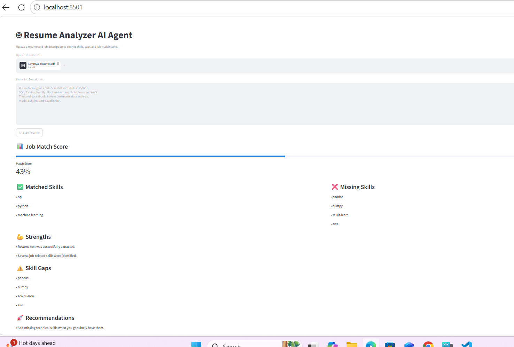

## Project Overview

Resume Analyzer AI Agent is an AI-powered application that analyzes a candidate's resume against a job description. It extracts resume information, identifies matching and missing skills, calculates a job-match score, and provides personalized recommendations to improve the resume.

## Key Features

- PDF Resume Upload
- Resume Text Extraction
- Job Description Analysis
- Matched Skills Detection
- Missing Skills & Skill Gap Analysis
- Job Match Score
- AI-based Resume Recommendations
- Streamlit Web Interface

## Tech Stack

Python | Streamlit | PyPDF | OpenAI API | NLP | LLM

## How It Works

Resume PDF → Text Extraction → Job Description Comparison → Skill Analysis → Match Score → Recommendations

## Output / Demo

The application analyzes the uploaded resume against the job description and provides a job-match score, matched skills, missing skills, skill gaps, and recommendations.

